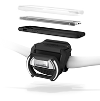
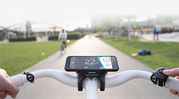
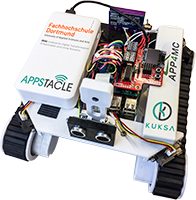

# BCX19 Mobility Challenge

## Available hardware

### E-Bikes with COBI.Bike

* Available: 3x E-Bikes with COBI.Bike unit and smartphones

COBI.js interfaces: https://cobi-bike.github.io/COBI.js/
Chrome Simulator: https://chrome.google.com/webstore/detail/cobibike-devkit-simulator/hpdhkapigojggienmiejhblkhenjdbno 

#### Which data is available?

* Data from eBike Drive Unit
  * Battery range, odometer, assistance modes
* Sensors embedded in mobile device
  * GPS, Gyroscope, accelerometer
* External sensors
  * Heart rate, cadence, speed
  
#### How to access data?

COBI.js - a JavaScript library that abstracts the Bluetooth connections, authentication or CAN BUS and allows the developer to focus on the data

#### How to interact with the device or the system?

The COBI.Bike app and Hub: https://cobi.bike/product 

#### What events are available?

* Developers can subscribe to the streams of data they wish to access

### Eclipse Kuksa RC Rovers

* Available: 3x Rovers

#### Which data is available?

E.g. (live) Sensor Data 
* Camera
* Gyroscope
* Ultrasonic sensors
* Infrared sensors
* Temperature
* Humidity

#### How to access data?

* Retrieve data from database (where it was stored through Eclipse Hono)
* Sending data to vehicle via HONO to vehicle API

#### How to interact with the device or the system?

* Send data to hosted Eclipse Hono instance
* Eclipse hawkBit and connected App-Store
* Eclipse Che instance to implement applications

#### What events are available?

* App development and deployment 
* Push notifications
* Command & control of Rover

#### Useful links

https://www.eclipse.org/kuksa/
https://www.eclipse.org/kuksa/resources/
https://app4mc-rover.github.io/rover-docs/

Programmable dongle to access vehicle diagnosis port
Currently we work on integrating authorization flows into Eclipse Kuksa

