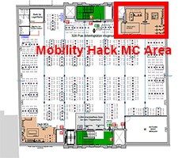

# BCX19 Mobility Challenge

* [Bosch Connected Experience website](https://bosch-connected-world.com/hackathon/mobility/)

* When: Monday, May 13 to Wednesday, May 15 2019
* Where: [Kühlhaus Berlin](https://goo.gl/maps/qGVMvogz7xYL7qDH6) **5th floor**

## Available hardware

### E-Bikes with COBI.Bike

* Available: 3x E-Bikes with COBI.Bike unit and smartphones in HackMC area
* Contact person: _coming soon_

* COBI.js interfaces: https://cobi-bike.github.io/COBI.js/
* Chrome Simulator: https://chrome.google.com/webstore/detail/cobibike-devkit-simulator/hpdhkapigojggienmiejhblkhenjdbno 

#### Which data is available?

* Data from eBike Drive Unit
  * Battery range, odometer, assistance modes
* Sensors embedded in mobile device
  * GPS, Gyroscope, accelerometer
* External sensors
  * Heart rate, cadence, speed
  
#### How to access data?

COBI.js - a JavaScript library that abstracts the Bluetooth connections, authentication or CAN BUS and allows the developer to focus on the data

#### How to interact with the device or the system?

The COBI.Bike app and Hub: https://cobi.bike/product 

#### What events are available?

* Developers can subscribe to the streams of data they wish to access

### Eclipse Kuksa RC Rovers

* Available: 3x Rovers in HackMC area
* Contact person: _coming soon_

#### Which data is available?

E.g. (live) Sensor Data 
* Camera
* Gyroscope
* Ultrasonic sensors
* Infrared sensors
* Temperature
* Humidity

#### How to access data?

* Retrieve data from database (where it was stored through Eclipse Hono)
* Sending data to vehicle via HONO to vehicle API

#### How to interact with the device or the system?

* Send data to hosted Eclipse Hono instance
* Eclipse hawkBit and connected App-Store
* Eclipse Che instance to implement applications

#### What events are available?

* App development and deployment 
* Push notifications
* Command & control of Rover

#### Useful links

* https://www.eclipse.org/kuksa/
* https://www.eclipse.org/kuksa/resources/
* https://app4mc-rover.github.io/rover-docs/

Programmable dongle to access vehicle diagnosis port.
Currently we work on integrating authorization flows into Eclipse Kuksa

### EV Challenge Jaguar I-PACE

* Available: 1x Jaguar I-PACE in front of building
* Contact person: _coming soon_

CAN Bus data available over HTTP

_more information coming soon_

### Anki Overdrive

* Available: 1x Track in the HackMC area with 4 cars
* Contact person: Pedro Silva

_more information coming soon_

### Audi e-Tron brake data

* Not physically available, only data access on demand

Ask the Bosch IoT Insights Hack Coaches

## Available software services

### Bosch IoT Suite

Devices are typically connected to the Bosch IoT Hub, which pushed data to Bosch IoT Things. Changes of Things are recorded by Bosch IoT Insights and preserved for further analysis.

* **Bosch IoT Insights**

  The easy way to manage your IoT device data 
  https://bosch-iot-insights.com

* **Bosch IoT Things**
  
  Managed inventory of digital twins for IoT device assets

* **Bosch IoT Hub**
  
  Easy and secure device connectivity for the IoT

[Book your free plan](https://accounts.bosch-iot-suite.com/subscriptions/)

Find our Hack Coaches on the Marketplace on the 2nd floor.

### Here.com Telematics API

TBD: Logo, Description

* Contact person: _coming soon_

https://developer.here.com/documentation/fleet-telematics/dev_guide/topics/use-cases.html

### Axel Springer: Clever Tanken API

#### Which data is available?

* Gas stations (address, opening hours, div. features)
* Gas prices
* Car wash facilities

#### How to access data?

* Clever Tanken API
* Hack coach provides credentials 

#### Ideas

* OnMyWay: An app that shows the user where on his/her way the next e.g. McDonalds, Sanifair, Rewe, baby changing table, kids playground etc. is
* Gas price trend prediction

### Axel Springer: upday API

#### Which data is available?

* Top News Teaser (between 9 and 11)
  * URL to original source, image URL
  * title, preview text
  * publish time
  * category
  
* this is live news data
* it is available for 10 locales, curated by several editorial teams
* it is updated irregularily whenever something interesting or relevant happens
* the content of the specific locales differs
* valid locales are: de-DE, de-AT, de-CH, nl-BE, nl-NL, fr-FR, pl-PL, en-GB, es-ES, it-IT

#### How to access data?

Requests to REST API:

    curl -u 'api:<pw>' http://boschhackathon.topnews.upday.com/api/v1/top-news/{locale}

Password provided by Hack Coach

### TIBCO

  

 
Project Flogo is a go-based open source ecosystem for building event-driven apps and has the notion of triggers and actions to process any incoming event.

  

#### When to use Flogo?
If you’re dev & sick of building all the messy stuff that comes along with coding production apps, such as connectivity to event-driven messaging platforms, datastores, SaaS apps, etc & want to deploy to a wide range of targets, such as

* serverless compute
* IoT edge devices
* containers

then Project Flogo is for you!

#### How to access data? 
You can use one of our triggers to receive data. Examples triggers are:
* Kafka, MQTT, CoAP, REST, GraphQL, AWS Lambda, Timer, AMQP ...and many others

You can use one of our actions to process or send data back. Examples activities are: 
* Log, MQTT, Kafka, AMQP, Trello, Write to File, Pushbullet, Tensorflow, IFTTT, AWS S3, RasPi GPIO

We have selected some of the triggers and activities to participate in the Bosch Mobility Hackathon:
* Send MQTT data: https://github.com/ayh20/flogo-components/tree/master/activity/mqtt
* Send AMQP data: https://github.com/skothari-tibco/amqp10/activity
* Recieve AMQP data: https://github.com/skothari-tibco/amqp10/trigger
* Recieve MQTT data: https://github.com/ayh20/flogo-components/tree/master/trigger/mqtt

...and you can contribute in the development of new triggers and activities as well.

Have also a look to our showcases with many more triggers, activities and apps

* https://tibcosoftware.github.io/flogo/showcases/
* https://tibcosoftware.github.io/tci-awesome/

#### How to get Project Flogo?
Project Flogo can be downloaded from github and more details can be found here 
https://github.com/tibcosoftware/flogo

A Web UI to develop with a zero-code approach is available via Docker (highly recommended for the Hackathon):
https://hub.docker.com/r/flogo/flogo-docker

You can run Flogo on your laptop, on a edge device like a RasPi, on a container like OpenShift or even on AWS Lambda 

The Flogo Web UI comes along with all required components to begin developing, testing and building deployable artifacts from your web browser.

Find our Hack Coaches on the Marketplace on the 2nd floor. We show you how to connect to the Bosch IoT Hub, receive device messages and build something cool!

#### Ideas
Wouldn’t it be great to predict when an anomaly is around the corner and alert promptly that condition? By having the availability of a eBike or a RC rover, many sensors that equip those devices are sending data to the Bosch IoT Hub. These data can be used against a Machine Learning Model to detect and raise particular conditions.

##### Intelligent Bike Crash detection
Normally a bike has mostly two states, someone is riding the bike or the bike is stationary on its side stand. When the bike is being ridden, it has a velocity, is experiencing 3 dimensional GForces and is “mostly” in a vertical orientation but never horizontal. The bike may not be moving, but still the position is essentially vertical. But what has happened if suddenly the acceleration is negative, the Gforces are excessive and the position is horizontal? It almost certainly indicative that a crash happened. Under these circumstances, a notification can be sent immediately to the Fleet Manager who may want to call you and ask if assistance is needed.
All this can be achieved with an event-driven application. This is where Flogo is your friend! Connect to the Bosch IoT Hub with a Flogo event trigger, process incoming sensor data from the eBike and evaluate the data against a Tensorflow-based Machine Learning model to detect various anomalies.

##### Good driver against bad driver (and get some points)
Good driving behaviour is key to getting bonus user points or a discount for the next eBike rental! But how do you identify a good versus a bad driver? An eBike has many sensors, sending data like acceleration, speed, position, inclination. What if the acceleration, the speed and the angle of inclination of the bike can be used to determine driving behaviour? If there are frequent accelerations/decelerations and the angle often changes, that could identify a bad driver. In that case, a message is sent back to the Bosch IoT Hub for further processing.

##### Bike theft detector
eBike doesn’t want their money makers to just wander off and never be scene again. How do you discern between a valid rental and theft?  Can the acceleration, speed, position, and inclination be used to detect if a bike has been put in a truck?

##### Are my sensors working?
Nowadays all vehicles are fitted with multiple sensors. They’re used to get feedback of the position, inclination, speed, g-forces, temperatures, etc. But what if a sensor is malfunctioning? If a sensor used to send a reading each 2 seconds and suddenly that reading doesn’t come or the intervall isn’t regular, we may conclude that the sensor has failed or will fail in the near future. By deciding which sensors are the most critical ones, we could monitor if the reading are arriving when expected and eventually raise an alert in order to proceed and replace the faulty sensor.

### Red Hat

TBD

### Mathworks

Get a Matlab license for the hackathon and get support from the Hack Coaches.

TBD

